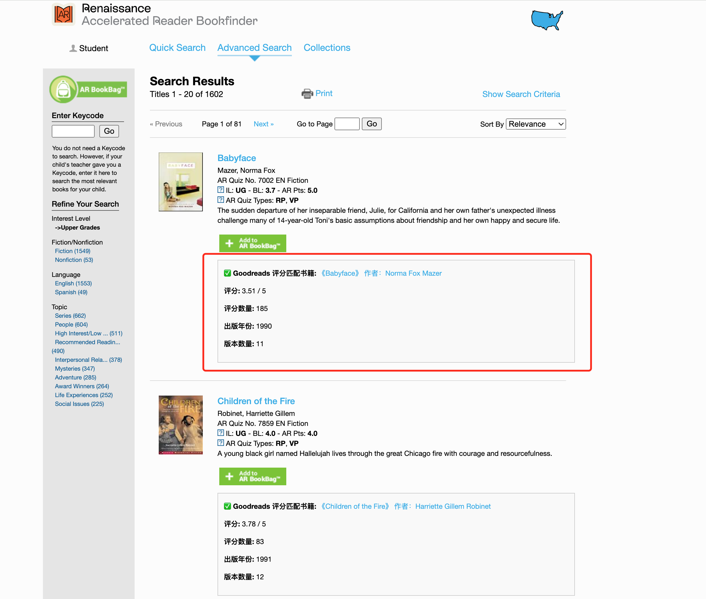
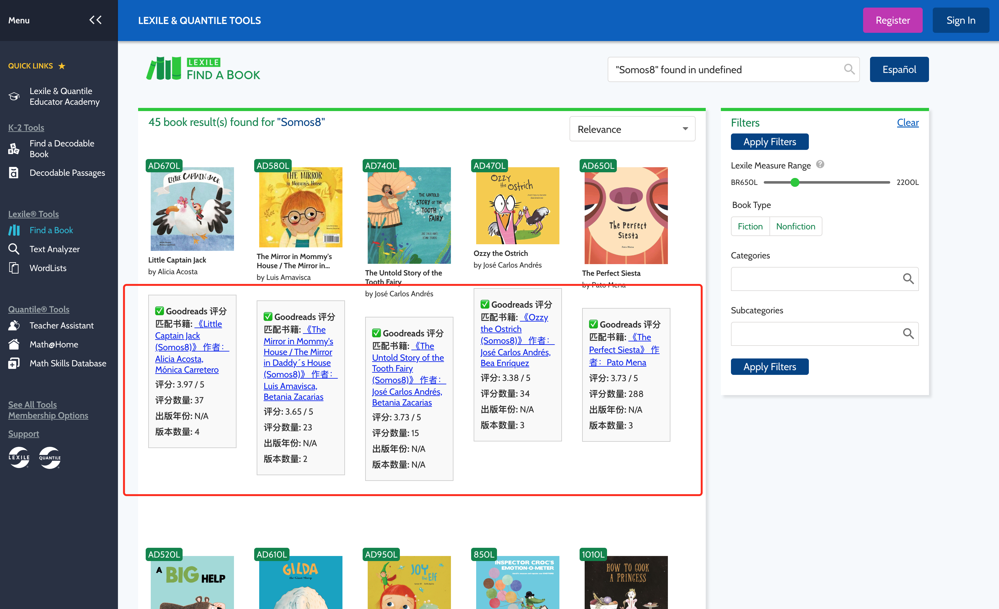

This is a Chrome plugin that displays book rating information from Goodreads on arbookfind.com and hub.lexile.com, helping you find English books suitable for your reading level and with high ratings.

一个Chrome插件，可以在浏览 arbookfind.com 和 hub.lexile.com 时结果列表显示 goodreads.com (国外版豆瓣)的图书评分信息(0-5分制)，帮助您找到适合您英语难度水平的高分英语书

### Screenshot of running example

##### arbookfind.com

##### hub.lexile.com
